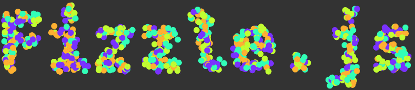

# Fizzle.js
[](https://david-dm.org/GMartigny/fizzle.js)
[](https://david-dm.org/GMartigny/fizzle.js?type=dev)



Write any text in a canvas with fizzly bubbles.

# Installation

    npm install fizzle.js

# Usage

Once installed, add it to your project with common.js or ES6 syntax :

```js
    const Fizzle = require("fizzle.js");
    // or
    import Fizzle from "fizzle.js";
```

Then, you can start to use it on your code :

```js
    const text = "Hello world";
    const options = {
        font: "monospace",
        fontSize: 42,
        colors: ["red", "green", "blue"]
    };
    // Instantiate a new Fizzle
    let myFyzzle = new Fizzle(text, options);
    const ctx = myCanvas.getContext("2d");
    
    // Function run each frame
    function loop () {
        ctx.clearRect(0, 0, myCanvas.width, myCanvas.height);
        ctx.save();
        ctx.translate(x, y); // move to desired location
        myFyzzle.render(ctx); // draw it
        ctx.restore();
    }
```

Since today's web browser don't support module requirements yet, you need to use a bundler like [webpack](https://webpack.js.org/) or [browserify](http://browserify.org/).

## CDN

Ok, I got you. If you want to go old-school, just load the script with [unpkg](https://unpkg.com/) or [jsdelivr](https://www.jsdelivr.com/).

```html
    <script src="https://unpkg.com/fizzle.js"></script>
    <!-- or -->
    <script src="https://cdn.jsdelivr.net/npm/fizzle.js"></script>
```


## Documentation

Go see the [full documentation](documentations.md) or [some examples](https://gmartigny.github.io/fizzle.js).


## License

[MIT](license)
